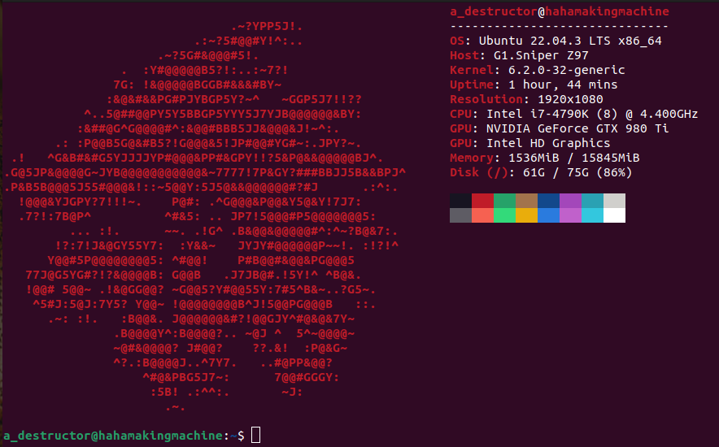

# Neofetch_Terminal_Drip
This will be a summary of how I made the drippiest drip for my terminal.

1. Install neofetch
   ``
   sudo apt install neofetch
   ``
2. Enter the following command to open neofetch settings
   ``
   sudo gedit /usr/bin/neofetch
   ``
3. Remove any of the existing OS's logos and put L-Drago SIZE=50 in its place. I removed Red Star just because it fits L-Drago's aesthetics. Do not forget to save before exiting.
4. Open neofetch's config file
   ``
   sudo gedit ~/.config/neofetch/config.conf
   ``
5. Only show the following:
   ``
    info title
    info underline
    info "OS" distro
    info "Host" model
    info "Kernel" kernel
    info "Uptime" uptime
    info "Resolution" resolution
    info "CPU" cpu
    info "GPU" gpu
    info "Memory" memory
    info "Disk" disk
   ``
6. Search for `ascii_distro` and change it to the distro you placed L-Drago as its logo. Save before exiting.
   ``
   ascii_distro="Red Star"
   ``
7. To run neofetch every time the terminal starts, add it to `.bashrc`.
   ``
   vim ~/.bashrc
   /* write neofetch at the end of the file + save before exiting */
   neofetch
   ``
8. Source bashrc after exiting to load changes.
   ``
   source ~/.bashrc
   ``
9. Profit!
    
